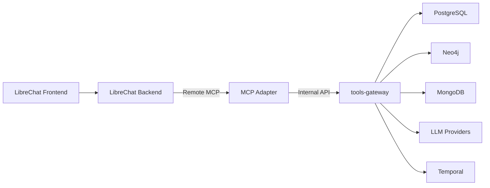

# MCP Adapter для tools-gateway

## Обзор

Внешний MCP (Model Context Protocol) адаптер сервер, который предоставляет интерфейс для интеграции с LibreChat через UI remote MCP registration. Адаптер выступает в роли тонкого прокси-слоя между LibreChat и внутренним `tools-gateway` сервисом.

**ВАЖНО**: Адаптер реализует **настоящий MCP-compatible remote server** в соответствии со спецификацией Model Context Protocol, а не заменяет его обычным REST API. Это позволяет LibreChat подключаться к адаптеру как к удаленному MCP серверу через UI.

## Архитектура

```mermaid
graph TD
    A[LibreChat UI] -->|Remote MCP Registration| B[MCP Adapter Server]
    B -->|MCP Protocol (streamable-http)| C[tools-gateway]
    C -->|PostgreSQL/Neo4j/MongoDB| D[Data Stores]
    C -->|LLM Providers| E[External APIs]
    C -->|Temporal/NATS| F[Workflow Services]
```

## Компоненты

### 1. MCP Adapter Server
- **Язык**: Python 3.11+
- **Фреймворк**: FastAPI + выбранная MCP Python библиотека
- **Протокол**: Model Context Protocol (совместим с LibreChat remote MCP)
- **Transport**: streamable-http (основной для production), SSE (допустимо как future option)
- **Аутентификация**: Bearer token (обязательно на выходе к tools-gateway)

### 2. Основные функции
- **search_context** - поиск контекста для беседы
- **submit_ingest** - отправка данных для индексации
- **ingest_status** - проверка статуса индексации

### 3. Интеграция
Адаптер напрямую вызывает HTTP эндпоинты `tools-gateway`:
- `POST /tool/search_context`
- `POST /tool/submit_ingest`
- `GET /tool/ingest_status/{job_id}`

## Дизайн-принципы

1. **Тонкий адаптер** - минимальная бизнес-логика, максимум проксирования
2. **Совместимость** - полная совместимость с LibreChat remote MCP registration
3. **Безопасность** - обязательная аутентификация для вызовов tools-gateway
4. **Наблюдаемость** - логирование и метрики для мониторинга
5. **Отказоустойчивость** - корректная обработка ошибок и таймаутов

## Совместимость с LibreChat

Адаптер полностью совместим с официальной документацией LibreChat по remote MCP registration:
- Поддерживает подключение через LibreChat UI как remote MCP server
- Использует рекомендуемый transport: `streamable-http` (основной для production)
- Не требует изменений в коде LibreChat (адаптер работает как отдельный сервис)
- Поддерживает передачу headers, timeout и serverInstructions через UI

## Расположение в архитектуре



Адаптер находится на границе между внешним интерфейсом LibreChat и внутренним сервисом `tools-gateway`, обеспечивая безопасную и стандартизированную интеграцию.