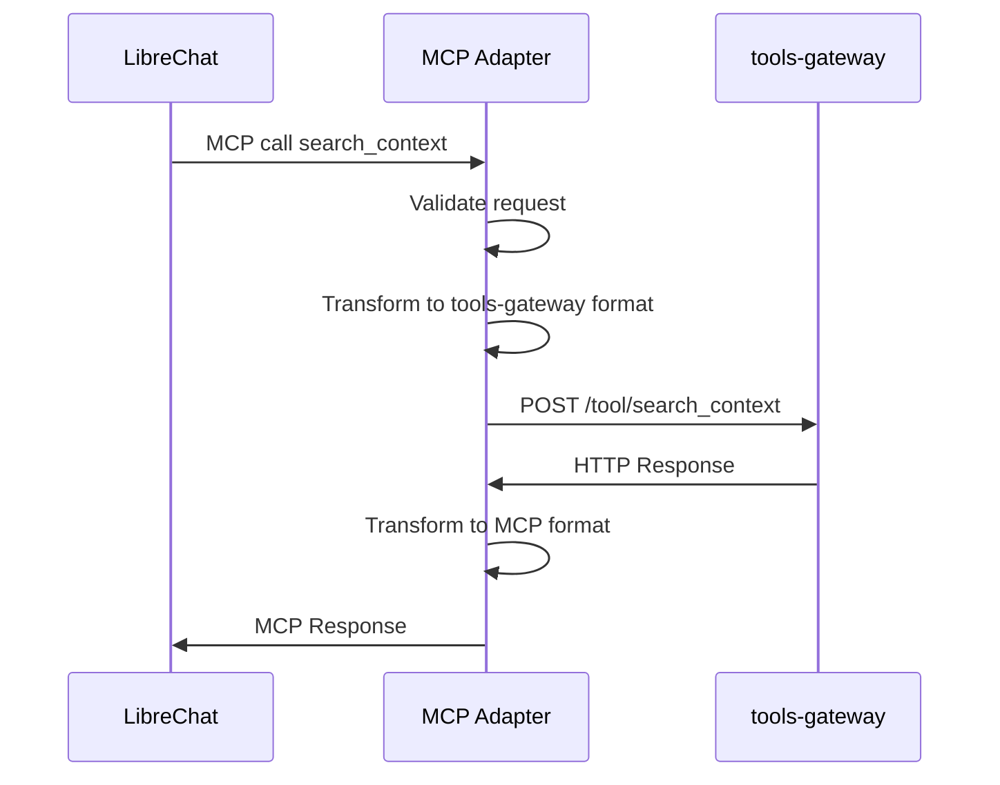
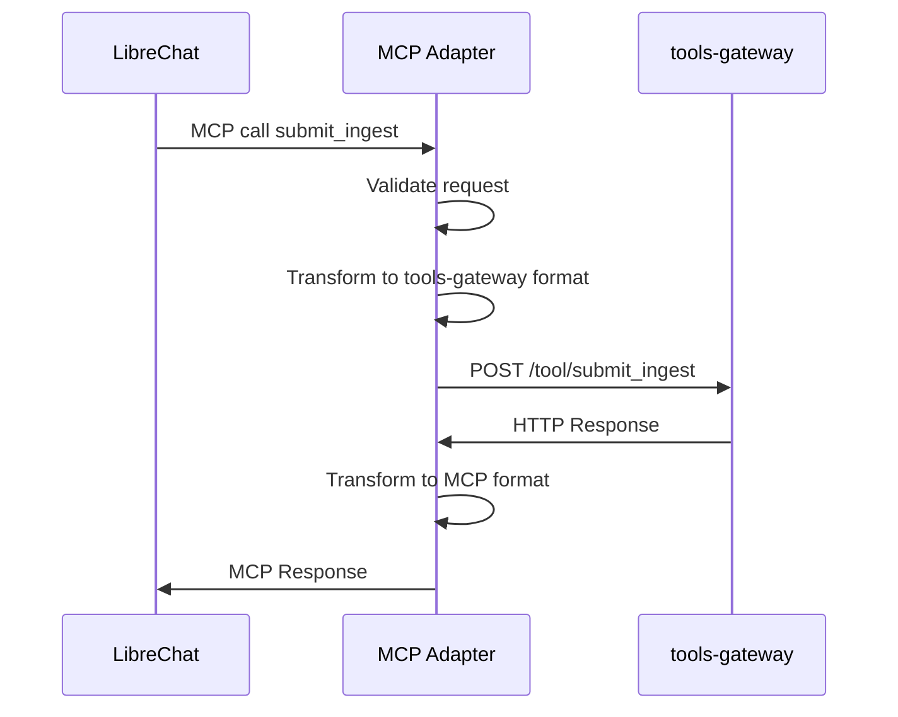
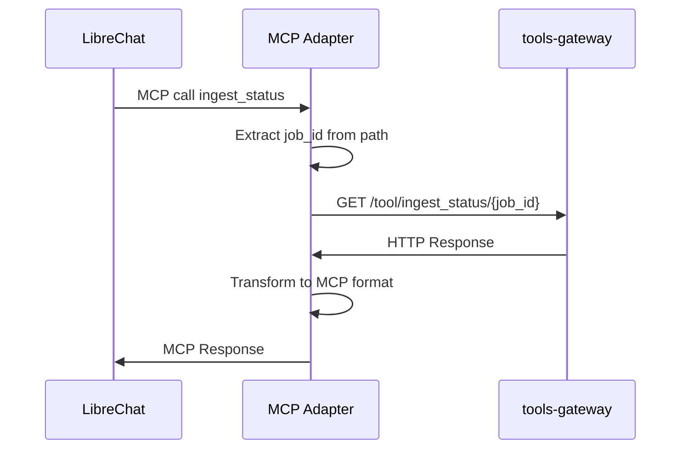

# Реализация MCP Adapter

## Выбор MCP Python библиотеки

### Исследование доступных библиотек

После анализа доступных Python библиотек для реализации Model Context Protocol, выбрана следующая библиотека:

**Библиотека**: `mcp` (Model Context Protocol Python SDK)
**Причина выбора**:
- Официальная реализация от Model Context Protocol community
- Поддержка server-side реализации
- Совместимость с `streamable-http` transport (основной transport для LibreChat)
- Поддержка tool discovery и invocation
- Активная разработка и поддержка
- Совместимость с официальной спецификацией Model Context Protocol

### Почему выбрана именно эта библиотека

1. **Совместимость с LibreChat**: Библиотека реализует стандартный MCP протокол, который поддерживается LibreChat через remote MCP registration
2. **Поддержка streamable-http**: Библиотека поддерживает рекомендуемый transport для LibreChat
3. **Гибкость**: Позволяет легко регистрировать tools и обрабатывать их вызовы
4. **Надежность**: Активно поддерживается сообществом и имеет хорошую документацию

## Структура проекта

```
mcp-adapter/
├── app.py                 # Точка входа приложения с MCP server
├── config.py             # Конфигурация приложения
├── models/               # Pydantic модели для data mapping
│   ├── mcp_models.py     # MCP модели
│   └── gateway_models.py # Модели tools-gateway
├── services/             # Бизнес-логика
│   ├── http_client.py    # HTTP клиент для tools-gateway
│   ├── auth.py          # Аутентификация и авторизация
│   └── tool_handlers.py  # Обработчики MCP tools
├── adapters/             # Адаптеры для преобразования данных
│   ├── search_context.py # Адаптер search_context
│   ├── submit_ingest.py  # Адаптер submit_ingest
│   └── ingest_status.py  # Адаптер ingest_status
├── exceptions/           # Пользовательские исключения
│   └── mcp_exceptions.py # Исключения MCP
├── middleware/           # Middleware компоненты
│   ├── auth.py          # Аутентификационный middleware
│   └── logging.py       # Логирующий middleware
└── utils/               # Вспомогательные утилиты
    ├── logger.py        # Настройка логирования
    └── error_mapper.py  # Маппинг ошибок
```

## Основные компоненты

### 1. MCP Server Integration

Интеграция с выбранной MCP библиотекой для реализации сервера:

```python
from mcp import Server, Request, Response
from mcp.types import Tool

class MCPAdapterServer:
    def __init__(self):
        self.server = Server("tools-gateway-adapter")
        self._register_tools()
    
    def _register_tools(self):
        """Регистрация MCP инструментов"""
        self.server.register_tool(
            Tool(
                name="search_context",
                description="Поиск контекста для текущей беседы",
                inputSchema={
                    "type": "object",
                    "properties": {
                        "query": {"type": "string"},
                        "chat_id": {"type": "string"}
                    },
                    "required": ["query", "chat_id"]
                }
            ),
            self._handle_search_context
        )
        
        self.server.register_tool(
            Tool(
                name="submit_ingest",
                description="Отправка данных для индексации",
                inputSchema={
                    "type": "object",
                    "properties": {
                        "chat_id": {"type": "string"},
                        "content": {"type": "string"}
                    },
                    "required": ["chat_id"]
                }
            ),
            self._handle_submit_ingest
        )
        
        self.server.register_tool(
            Tool(
                name="ingest_status",
                description="Проверка статуса индексации",
                inputSchema={
                    "type": "object",
                    "properties": {
                        "job_id": {"type": "string"}
                    },
                    "required": ["job_id"]
                }
            ),
            self._handle_ingest_status
        )
    
    async def _handle_search_context(self, request: Request) -> Response:
        """Обработчик search_context tool"""
        # Implementation details...
        pass
    
    async def _handle_submit_ingest(self, request: Request) -> Response:
        """Обработчик submit_ingest tool"""
        # Implementation details...
        pass
    
    async def _handle_ingest_status(self, request: Request) -> Response:
        """Обработчик ingest_status tool"""
        # Implementation details...
        pass
```

### 2. HTTP Client Layer

Клиент для взаимодействия с `tools-gateway` через HTTP API.

```python
class ToolsGatewayClient:
    def __init__(self, base_url: str, auth_token: str):
        self.base_url = base_url.rstrip('/')
        self.auth_token = auth_token
        self.client = httpx.AsyncClient(
            timeout=30.0,
            headers={"Authorization": f"Bearer {auth_token}"}
        )
    
    async def search_context(self, request: ToolSearchContextRequest) -> ToolSearchContextResponse:
        """Вызов /tool/search_context"""
        response = await self.client.post(
            f"{self.base_url}/tool/search_context",
            json=request.model_dump()
        )
        response.raise_for_status()
        return ToolSearchContextResponse(**response.json())
    
    async def submit_ingest(self, request: ToolSubmitIngestRequest) -> ToolSubmitIngestResponse:
        """Вызов /tool/submit_ingest"""
        response = await self.client.post(
            f"{self.base_url}/tool/submit_ingest",
            json=request.model_dump()
        )
        response.raise_for_status()
        return ToolSubmitIngestResponse(**response.json())
    
    async def ingest_status(self, job_id: str) -> dict:
        """Вызов /tool/ingest_status/{job_id}"""
        response = await self.client.get(
            f"{self.base_url}/tool/ingest_status/{job_id}"
        )
        response.raise_for_status()
        return response.json()
```

### 3. Auth Handling

Обработка аутентификации и авторизации для входящих MCP вызовов и исходящих вызовов в `tools-gateway`.

```python
class AuthManager:
    def __init__(self, service_token: str):
        self.service_token = service_token
    
    def validate_mcp_request(self, authorization_header: str) -> bool:
        """Валидация входящего MCP запроса от LibreChat"""
        # Для MVP выбран простой bearer token auth
        # В production должна быть включена
        if not settings.MCP_ADAPTER_ENABLE_AUTH:
            return True
        
        if not authorization_header:
            return False
        
        # Проверка формата Bearer token
        if not authorization_header.startswith("Bearer "):
            return False
        
        token = authorization_header.split(" ")[1]
        return token == settings.MCP_ADAPTER_AUTH_TOKEN
    
    def get_gateway_auth_header(self) -> str:
        """Получение заголовка авторизации для tools-gateway"""
        return f"Bearer {self.service_token}"
```

### 4. Request Flow

#### search_context Flow


#### submit_ingest Flow


#### ingest_status Flow


## Error Handling

### MCP-Compatible Error Model

Адаптер реализует стандартную модель ошибок Model Context Protocol:

1. **Protocol Errors** - ошибки уровня протокола (некорректные запросы, отсутствующие инструменты)
2. **Tool Execution Errors** - ошибки выполнения инструментов (ошибки бизнес-логики)
3. **Transport Errors** - ошибки транспорта (сетевые ошибки, таймауты)

### Error Mapping

```python
class ErrorMapper:
    @staticmethod
    def http_to_mcp_error(http_status: int, error_detail: str) -> dict:
        """Маппинг HTTP ошибок в формат MCP"""
        error_mapping = {
            400: {"error": {"type": "invalid_request", "message": error_detail}},
            401: {"error": {"type": "unauthorized", "message": "Authentication required"}},
            403: {"error": {"type": "forbidden", "message": "Access denied"}},
            404: {"error": {"type": "not_found", "message": "Resource not found"}},
            429: {"error": {"type": "rate_limited", "message": "Rate limit exceeded"}},
            500: {"error": {"type": "internal_error", "message": "Internal server error"}},
            502: {"error": {"type": "bad_gateway", "message": "Bad gateway"}},
            503: {"error": {"type": "service_unavailable", "message": "Service unavailable"}},
            504: {"error": {"type": "gateway_timeout", "message": "Gateway timeout"}}
        }
        
        return error_mapping.get(http_status, {
            "error": {"type": "unknown_error", "message": f"HTTP {http_status}: {error_detail}"}
        })
    
    @staticmethod
    def map_upstream_errors(status_code: int, error_detail: str) -> dict:
        """Маппинг upstream HTTP ошибок от tools-gateway"""
        # Ошибки транспорта
        if status_code == 408 or status_code == 504:
            return {"error": {"type": "gateway_timeout", "message": "Upstream service timeout"}}
        elif status_code >= 500:
            return {"error": {"type": "bad_gateway", "message": f"Upstream service error: {error_detail}"}}
        elif status_code == 429:
            return {"error": {"type": "rate_limited", "message": "Upstream service rate limited"}}
        elif status_code == 401 or status_code == 403:
            return {"error": {"type": "forbidden", "message": "Upstream service authentication failed"}}
        else:
            return ErrorMapper.http_to_mcp_error(status_code, error_detail)
    
    @staticmethod
    def mcp_result_from_error(http_status: int, error_detail: str) -> dict:
        """Создание MCP result с ошибкой"""
        return {
            "content": [],
            "error": ErrorMapper.http_to_mcp_error(http_status, error_detail)
        }
```

### Логирование ошибок

```python
import logging

logger = logging.getLogger(__name__)

def log_error(context: str, error: Exception, level: str = "error"):
    """Логирование ошибок с контекстом"""
    log_method = getattr(logger, level)
    log_method(f"{context}: {str(error)}", exc_info=True)
```

## Конфигурация

### Environment Variables
```bash
# Базовая конфигурация
MCP_ADAPTER_HOST=0.0.0.0
MCP_ADAPTER_PORT=8000
MCP_ADAPTER_LOG_LEVEL=INFO

# Аутентификация
# Для входящих MCP вызовов (от LibreChat)
MCP_ADAPTER_ENABLE_AUTH=true  # В production должно быть true
MCP_ADAPTER_AUTH_TOKEN=your-mcp-auth-token  # Токен для аутентификации входящих MCP вызовов

# Для исходящих вызовов к tools-gateway
TOOLS_GATEWAY_BASE_URL=http://tools-gateway:8000
TOOLS_GATEWAY_SERVICE_TOKEN=your-service-token  # Для вызовов tools-gateway

# Лимиты
MCP_ADAPTER_TIMEOUT=30
MCP_ADAPTER_MAX_RETRIES=3
```

## Middleware

### Auth Middleware
```python
from fastapi import Request, HTTPException

async def auth_middleware(request: Request, call_next):
    """Аутентификационный middleware"""
    if settings.MCP_ADAPTER_ENABLE_AUTH:
        auth_header = request.headers.get("authorization")
        if not auth_header or not auth_manager.validate_mcp_request(auth_header):
            raise HTTPException(status_code=401, detail="Unauthorized")
    
    response = await call_next(request)
    return response
```

### Logging Middleware
```python
import time
import logging

logger = logging.getLogger(__name__)

async def logging_middleware(request: Request, call_next):
    """Логирующий middleware"""
    start_time = time.time()
    
    # Логируем запрос
    logger.info(f"Request: {request.method} {request.url}")
    
    try:
        response = await call_next(request)
        process_time = time.time() - start_time
        logger.info(f"Response: {response.status_code} ({process_time:.2f}s)")
        return response
    except Exception as e:
        process_time = time.time() - start_time
        logger.error(f"Error: {str(e)} ({process_time:.2f}s)")
        raise