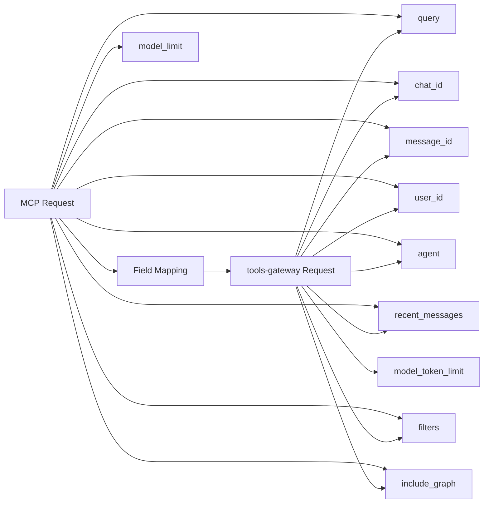
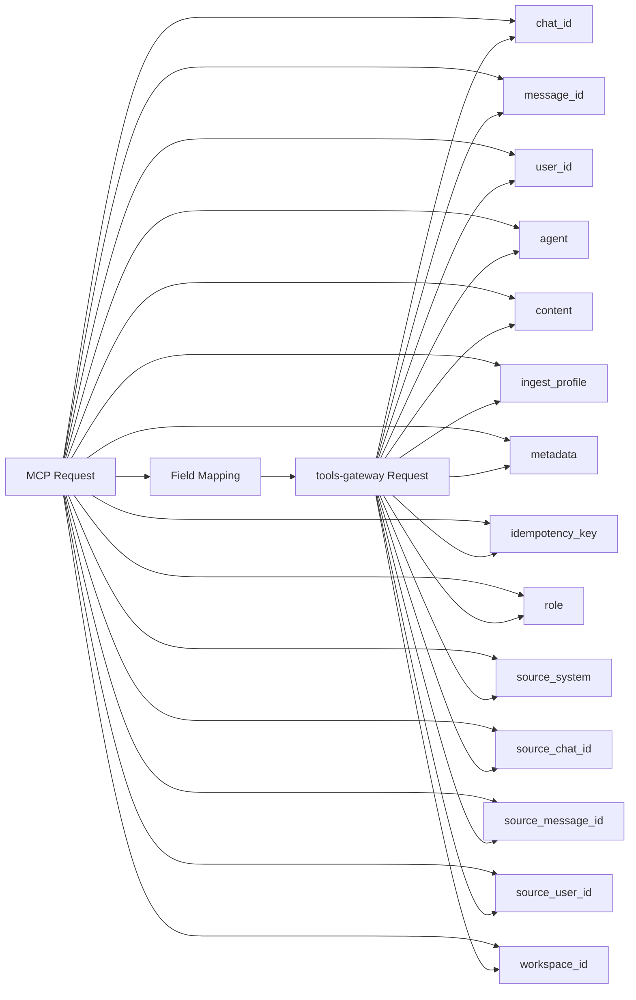
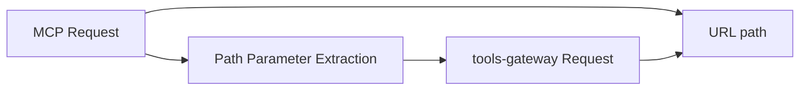
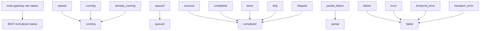

# Описание Tools MCP Adapter

## Обзор

MCP адаптер предоставляет 3 основных инструмента для работы с контекстом и индексацией данных:

1. `search_context` - поиск контекста для беседы
2. `submit_ingest` - отправка данных для индексации
3. `ingest_status` - проверка статуса индексации

**ВАЖНО**: Все инструменты реализуются в соответствии со спецификацией Model Context Protocol и регистрируются через выбранную MCP Python библиотеку.

## 1. search_context

### Назначение
Поиск релевантного контекста для текущей беседы, включая векторный поиск и графовый контекст.

### MCP Tool Definition
```json
{
  "name": "search_context",
  "description": "Поиск контекста для текущей беседы",
  "inputSchema": {
    "type": "object",
    "properties": {
      "query": {
        "type": "string",
        "description": "Поисковый запрос"
      },
      "chat_id": {
        "type": "string",
        "description": "Идентификатор чата"
      },
      "message_id": {
        "type": "string",
        "description": "Идентификатор сообщения (опционально)"
      },
      "user_id": {
        "type": "string",
        "description": "Идентификатор пользователя (опционально)"
      },
      "agent": {
        "type": "string",
        "description": "Идентификатор агента (опционально)"
      },
      "recent_messages": {
        "type": "array",
        "items": {
          "type": "object",
          "properties": {
            "role": {
              "type": "string",
              "enum": ["user", "assistant", "system", "tool"]
            },
            "content": {
              "type": "string"
            }
          },
          "required": ["role", "content"]
        },
        "description": "Короткий контекст последних сообщений"
      },
      "model_limit": {
        "type": "integer",
        "description": "Лимит токенов модели"
      },
      "filters": {
        "type": "object",
        "properties": {
          "date_from": {
            "type": "string",
            "format": "date-time"
          },
          "date_to": {
            "type": "string",
            "format": "date-time"
          },
          "roles": {
            "type": "array",
            "items": {
              "type": "string"
            }
          },
          "content_types": {
            "type": "array",
            "items": {
              "type": "string"
            }
          }
        }
      },
      "include_graph": {
        "type": "boolean",
        "description": "Включать ли графовый контекст"
      }
    },
    "required": ["query", "chat_id"]
  }
}
```

### Mapping на tools-gateway
- **MCP Tool**: `search_context` (MCP Protocol)
- **tools-gateway Endpoint**: `POST /tool/search_context` (HTTP)
- **Mapping**: Прямое соответствие полей

### Request Transformation


### Response Format
```json
{
  "status": "ok",
  "context_pack": {
    "short_context": "string or null",
    "retrieved_chunks": [
      {
        "doc_id": "string",
        "chunk_id": "integer",
        "content": "string",
        "metadata": {
          "score": "number",
          "match_type": "string",
          "role": "string or null",
          "created_at": "string or null",
          "content_dates": ["string"],
          "is_noise": "boolean",
          "entities": ["string"],
          "source_chunk_id": "string or null"
        },
        "score": "number"
      }
    ],
    "graph_context": {
      "lines": ["string"],
      "query_hint": "string or null",
      "summary": "string or null"
    },
    "summaries": ["string"],
    "sources": [{}],
    "budget_hint": {
      "context_tokens": "integer",
      "recommended_output_tokens": "integer"
    }
  }
}
```

## 2. submit_ingest

### Назначение
Отправка данных для индексации в систему (граф, суммаризация, память).

### MCP Tool Definition
```json
{
  "name": "submit_ingest",
  "description": "Отправка данных для индексации",
  "inputSchema": {
    "type": "object",
    "properties": {
      "chat_id": {
        "type": "string",
        "description": "Идентификатор чата"
      },
      "message_id": {
        "type": "string",
        "description": "Идентификатор сообщения (опционально)"
      },
      "user_id": {
        "type": "string",
        "description": "Идентификатор пользователя (опционально)"
      },
      "agent": {
        "type": "string",
        "description": "Идентификатор агента (опционально)"
      },
      "content": {
        "type": "string",
        "description": "Текст для индексации"
      },
      "ingest_profile": {
        "type": "string",
        "enum": ["graph_only", "summary_only", "memory_only", "full"],
        "description": "Профиль индексации"
      },
      "metadata": {
        "type": "object",
        "description": "Произвольные метаданные"
      },
      "idempotency_key": {
        "type": "string",
        "description": "Ключ идемпотентности"
      },
      "role": {
        "type": "string",
        "description": "Роль отправителя"
      },
      "source_system": {
        "type": "string",
        "description": "Система-источник"
      },
      "source_chat_id": {
        "type": "string",
        "description": "ID чата в системе-источнике"
      },
      "source_message_id": {
        "type": "string",
        "description": "ID сообщения в системе-источнике"
      },
      "source_user_id": {
        "type": "string",
        "description": "ID пользователя в системе-источнике"
      },
      "workspace_id": {
        "type": "string",
        "description": "ID workspace/tenant"
      }
    },
    "required": ["chat_id"]
  }
}
```

### Mapping на tools-gateway
- **MCP Tool**: `submit_ingest` (MCP Protocol)
- **tools-gateway Endpoint**: `POST /tool/submit_ingest` (HTTP)
- **Mapping**: Прямое соответствие полей

### Request Transformation


### Response Format
```json
{
  "status": "queued",
  "job_id": "string",
  "ingest_profile": "string"
}
```

## 3. ingest_status

### Назначение
Проверка статуса индексации по идентификатору задачи.

### MCP Tool Definition
```json
{
  "name": "ingest_status",
  "description": "Проверка статуса индексации",
  "inputSchema": {
    "type": "object",
    "properties": {
      "job_id": {
        "type": "string",
        "description": "Идентификатор задачи индексации"
      }
    },
    "required": ["job_id"]
  }
}
```

### Mapping на tools-gateway
- **MCP Tool**: `ingest_status` (MCP Protocol)
- **tools-gateway Endpoint**: `GET /tool/ingest_status/{job_id}` (HTTP)
- **Mapping**: Path parameter `job_id`

### Request Transformation


### Response Format
```json
{
  "status": "string",
  "job_id": "string",
  "children": {
    "graph": {
      "status": "string",
      "events": [{}]
    },
    "summary": {
      "status": "string",
      "events": [{}]
    },
    "memory": {
      "status": "string",
      "events": [{}]
    }
  },
  "events": [{}]
}
```

## Статусы задач

### Основные статусы
- `not_found` - задача не найдена
- `queued` - задача в очереди
- `running` - задача выполняется
- `completed` - задача завершена успешно
- `failed` - задача завершена с ошибкой
- `partial` - задача завершена частично

### Mapping статусов


## Поддержка Multi-User Context

Адаптер поддерживает передачу пользовательского контекста через заголовки, совместимые с LibreChat:

### Поддерживаемые заголовки
- `X-LibreChat-User-Id` - идентификатор пользователя
- `X-LibreChat-User-Email` - email пользователя
- `X-LibreChat-User-Role` - роль пользователя

Эти заголовки могут быть переданы через LibreChat UI при регистрации remote MCP server и будут доступны в контексте выполнения инструментов. Архитектура адаптера построена таким образом, что не блокирует расширение для поддержки user-specific data в будущем.

### Архитектурные особенности
- Поддержка multi-user context через заголовки
- Готовность к расширению для user-specific data
- Совместимость с LibreChat UI registration flow