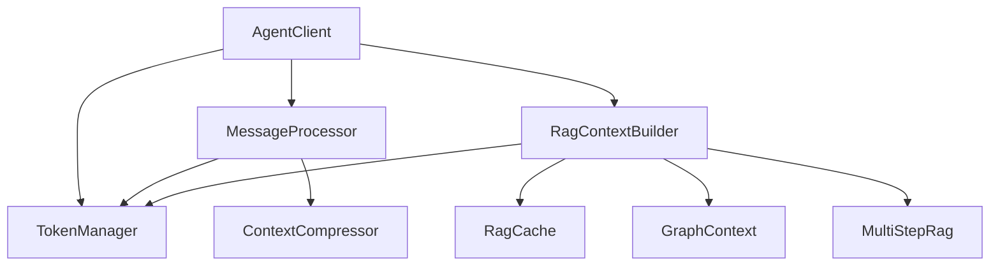

# Рефакторинг client.js

## Выполненные изменения

### 1. Разделение на сервисы

#### TokenManager
- Централизованное управление токенами
- Подсчет токенов для текста и сообщений
- Нормализация текста
- Валидация лимитов токенов

```javascript
const tokenManager = new TokenManager({
  defaultEncoding: 'o200k_base'
});

// Подсчет токенов
const tokenCount = tokenManager.getTokenCount(text);

// Проверка лимитов
tokenManager.validateMessages(messages, maxTokens);
```

#### MessageProcessor
- Обработка истории сообщений
- Подготовка сообщений для индексации
- Управление окном сообщений
- Интеграция с компрессором

```javascript
const processor = new MessageProcessor({
  tokenManager,
  compressor,
  metrics
});

const result = await processor.processMessageHistory({
  orderedMessages,
  conversationId,
  userId,
  ...options
});
```

#### RagContextBuilder
- Построение RAG контекста
- Интеграция с графом и vector store
- Кэширование контекста
- Multi-step RAG

```javascript
const builder = new RagContextBuilder({
  tokenManager,
  ragCache,
  metrics
});

const context = await builder.buildContext({
  orderedMessages,
  systemContent,
  runtimeCfg,
  req,
  res,
  endpointOption
});
```

### 2. Улучшения

#### Логирование
- Каждый сервис использует scoped логгер
- Единый формат логов с контекстом
- Трейсинг операций
- Структурированные ошибки

#### Метрики
- Подсчет токенов по сегментам
- Статистика кэша
- Метрики компрессии
- Метрики RAG

#### Тестирование
- Unit тесты для каждого сервиса
- Интеграционные тесты
- Моки зависимостей
- Проверка граничных случаев

## Взаимодействие компонентов



## Конфигурация

### TokenManager
```javascript
{
  defaultEncoding: 'o200k_base',
  features: {
    normalizeText: true,
    validateLimits: true
  }
}
```

### MessageProcessor
```javascript
{
  history: {
    dontShrinkLastN: 6,
    tokenBudget: 32000,
    contextHeadroom: 1000
  },
  thresholds: {
    histLongUserToRag: 15000,
    assistLongToRag: 15000,
    assistSnippetChars: 1500
  }
}
```

### RagContextBuilder
```javascript
{
  cache: {
    enabled: true,
    ttlMs: 300000
  },
  graph: {
    maxLines: 40,
    timeoutMs: 10000
  },
  multiStep: {
    enabled: true,
    intentTimeoutMs: 2000
  }
}
```

## Метрики

### TokenManager
- `token_count_total{service="tokens",type="text|message"}`
- `token_validation_total{service="tokens",status="success|error"}`

### MessageProcessor
- `message_processing_duration{service="messages",type="history|compress"}`
- `messages_processed_total{service="messages",type="user|assistant"}`

### RagContextBuilder
- `rag_context_build_duration{service="rag",type="simple|multi_step"}`
- `rag_cache_operations_total{service="rag",operation="hit|miss"}`
- `rag_tokens_total{service="rag",segment="graph|vector|entity"}`

## Логирование

### TokenManager
```javascript
[tokens.count.start] { text_length: 1000 }
[tokens.count.complete] { tokens: 100 }
[tokens.validate.error] { limit: 1000, actual: 1500 }
```

### MessageProcessor
```javascript
[messages.process.start] { message_count: 10 }
[messages.compress.complete] { ratio: 0.5 }
[messages.extract.error] { message_id: "msg-1" }
```

### RagContextBuilder
```javascript
[rag.context.build.start] { conversation_id: "conv-1" }
[rag.context.cache.hit] { cache_key: "key-1" }
[rag.context.build.complete] { context_length: 1000 }
```

## Следующие шаги

1. Интеграция с vector store в RagContextBuilder
2. Улучшение multi-step RAG
3. Оптимизация производительности
4. Расширение метрик и мониторинга