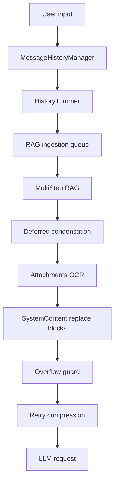

# План фиксов systemContent и ветвления истории в AgentClient

## 1. Диагностика и текущий пайплайн

1. `systemContent` собирается каскадом из инструкций агента, `additional_instructions` и динамических блоков (multi-step RAG, OCR, augmented prompt) внутри [`client.js`](api/server/controllers/agents/client.js:575). Лимиты на подстроки отсутствуют, триммирование происходит точечно (OCR, augmented) и не учитывает общую длину. ➡️ ✅ Исправлено: hash-регистр и `replace*`-блоки гарантируют одиночную вставку, а `rebalanceHistoryBudget()` пересчитывает headroom после каждого изменения.
2. История формируется через `MessageHistoryManager.processMessageHistory` и опциональный `HistoryTrimmer` ([`MessageHistoryManager.js`](api/server/services/agents/MessageHistoryManager.js:160), [`historyTrimmer.js`](api/server/services/agents/historyTrimmer.js:33)). После live-window/trimmer результаты напрямую идут в RAG builder без фиксации headroom после вставки System-блоков. ➡️ ✅ Исправлено: `historyTokenBudget` рассчитывается до `MessageHistoryManager` и пересобирается после multi-step RAG, deferred condensation, ragPatch, OCR/augmented и ragSections.
3. Вставки RAG и augmented выполняются последовательными `replace*` функциями, которые не гарантируют очистку старых версий и могут многократно увеличивать `systemContent` (например, повторное `replaceAugmentedBlock` при regen, `replaceOcrBlock` на последнем сообщении). ➡️ ✅ Исправлено: единый hash-регистр, `replaceRagSectionsBlock` с удалением и предотвращение повторных вставок RAG/OCR/augmented.
4. Ветвления истории возникают из-за повторных прогонов `buildMessages` без предварительного удаления старых assistant ответов (`Message.deleteMessagesSince` не вызывается), а также из-за того, что `processDroppedMessages` асинхронно двигает сообщения в память без подтверждения удаления. ➡️ ✅ Исправлено: при regen вызывается `deleteMessagesSince`, локально обрезается история после `parentMessageId`, а `agentConfigs` очищается для исключения повторного применения.

## 2. Стратегия ограничений systemContent

- **Контракт «один блок — один replace»** ✅ реализовано в `AgentClient` (hash-регистр RAG/OCR/augmented + `replaceRagSectionsBlock`).
- **Мягкие лимиты + headroom** ✅: после каждой вставки пересчитывается `instructions.tokenCount`, производится сравнение с `PromptBudgetManager.safeBudget`, и `historyTokenBudget` уменьшается до запуска `MessageHistoryManager`.
- **Очистка `contextHandlers`** ✅: после `createContext()` hash `augmentedPrompt` сохраняется и проверяется при regen, повторные вставки скипаются, `this.contextHandlers` сбрасывается.
- **Очистка `ragSections`** ✅: `replaceRagSectionsBlock` теперь удаляет устаревший сегмент при пустом блоке и пересобирает его при обновлении.
- **OCR блоки**: ограничить `message.ocr` до `runtimeCfg.limits.promptPerMsgMax`, логировать truncate (длина до/после) и включать в `req.ragMetrics`.

## 3. Управление RAG и history пайплайном

1. Зафиксировать последовательность: live window → history trimmer → ingestion enqueue → multi-step RAG → deferred condensation → attachments → overflow guard → retry compression. Нарушение порядка логировать как предупреждение (пример: RAG попытался применить блок при пустом `systemContent`).
2. Добавить флаг `req.ragContextAppliedHash` для контроля повторных `replaceRagBlock`: если hash совпадает, пропускать вставку и фиксировать в метриках.
3. В `MessageHistoryManager.processDroppedMessages` задерживать удаление из live window, пока ingest не подтвердит запись (fallback в `MemoryBacklog`). Это предотвращает ветвления при отказе очереди.
4. `OverflowGuardService` и `compressMessagesForRetry` должны учитывать, что часть сообщений уже промаркирована `metadata.isRagContext`; повторная компрессия должна сохранять пометки, чтобы не потерять связь с RAG блоками.

## 4. Ветвления messageId/parentId (бэкенд-фокус)

- Перед повторным запуском `buildMessages` вызывать `deleteMessagesSince` для текущего `parentMessageId`, а также удалять runtime-агента из `agentConfigs`, чтобы избегать повторного транслирования старых ответов.
- Для regen генерировать новый `responseMessageId`, но при необходимости переиспользовать последнюю user-ноду только после удаления всех прикреплённых assistant children.
- В `processDroppedMessages` и ingest задачах писать статусы в `req.historySync`, чтобы фронт (когда будет готов) мог синхронизироваться через события.

## 5. Логирование и метрики

| Срез | Что логируем | Где фиксировать |
| --- | --- | --- |
| SystemContent | длина и hash до/после каждого replace | [`client.js`](api/server/controllers/agents/client.js:1088) |
| RAG блоки | `ragSectionsLength`, `ragContextLength`, hash блока | [`client.js`](api/server/controllers/agents/client.js:1134) + `req.ragMetrics` |
| OCR/Augmented | оригинальная длина, усечённая длина, truncated flag | `replaceOcrBlock` / `replaceAugmentedBlock` |
| History | `liveWindowStats`, `trimmedDropped`, ingest подтверждения | [`MessageHistoryManager.js`](api/server/services/agents/MessageHistoryManager.js:415) |
| Overflow retries | действие guard, reductionFactor, итоговое количество сообщений | [`client.js`](api/server/controllers/agents/client.js:1606) |

## 6. Тестовая матрица

1. **Regen с большим augmentedPrompt**: убедиться, что hash блоков предотвращает дублирование и что `deleteMessagesSince` очищает старые assistant ответы.
2. **Большой OCR + multi-step RAG**: проверить комбинированные лимиты, чтобы `systemContent` не превышал бюджет, и что OCR ограничивается до `promptPerMsgMax`.
3. **Live window drop при недоступном ingest**: эмулировать отказ очереди и убедиться, что сообщения не удаляются, пока `enqueueMemoryTasks` не подтвердил операцию.
4. **Overflow retry**: провалить первый прогон по токенам и проверить, что повторный запуск не удваивает RAG блок.
5. **Deferred condensation**: при пустом `ragSections` и положительном `ragContextLength` триггерить предупреждение, фиксировать метрику для диагностики несогласованных пайплайнов.

## 7. Этапы внедрения

1. **Этап А: диагностика + логирование**
   - Включить длину/hash логов для всех `replace*` операций и ingest статусы.
   - Добавить предупреждения о нарушении порядка пайплайна.
2. **Этап B: контракты блоков и бюджеты**
   - Реализовать регистр block hashes, жёсткие лимиты на augmented/OCR, пересчёт `historyTokenBudget`.
   - Обновить `PromptBudgetManager` для учёта фактического `systemContentLength`.
3. **Этап C: ветвления и надёжность history**
   - Интегрировать `deleteMessagesSince`, подтверждения ingest и guard-aware retries.
   - Обновить `processDroppedMessages` и `enqueueMemoryTasks` с fallback в backlog.
4. **Этап D: тесты и rollout**
   - Прогнать сценарии из тестовой матрицы, расширить мониторинг.
   - Подготовить changelog и уведомить команды RAG/History.

## 8. Диаграмма пайплайна

## 9. Следующие действия

1. Подготовить технические задачи для этапа А (логирование и hash контроля) и согласовать с владельцами RAG/History.
2. Оценить влияние новых ограничений на текущих клиентов (особенно те, кто активно использует augmentedPrompt) и предупредить поддержку.
3. После реализации этапов А–C инициировать code review и подготовить документацию для итогового rollout.

Сообщите, устраивает ли структура плана и перечисленные этапы; при необходимости скорректирую детали перед переходом к реализации.
