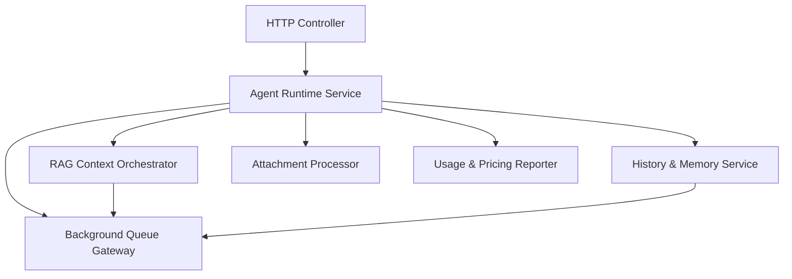

# План реорганизации client.js и request.js

## 1. Текущее состояние

- **Контроллер клиента** — [`client.js`](api/server/controllers/agents/client.js)
  - Управление RAG-кэшем, сбор графа/векторного контекста, суммаризация и вставка блоков в системные инструкции.
  - Исторический менеджмент (HistoryTrimmer, MessageHistoryManager), решение о компрессии и запись сообщений в память.
  - Обработка вложений, OCR, постановка задач на индексирование и deferred-condensation.
  - Мультишаговый RAG, запуск агентов/цепочек, работа с MCP и fallback-логикой.
  - Учёт стоимости и токенов, отчёты, логирование, обработка ошибок потока.

- **HTTP-орchestrator** — [`request.js`](api/server/controllers/agents/request.js)
  - Валидация запросов, инициализация клиента, управление SSE/Headless потоком.
  - Очереди памяти/графа/саммари с resilience, дедупликация, метрики.
  - Принятие длинных текстов и предварительная индексация, триггер саммаризации.
  - Сохранение сообщений, генерация заголовков, очистка ресурсов и обработка abort.

## 2. Нарушения единой ответственности

1. **Монолитные классы**: `AgentClient` объединяет контекст, историю, память, мультимодальные вложения и подсистему биллинга.
2. **Дублирование RAG-инфраструктуры**: построение контекста, кеш и deferred-сценарии смешаны с HTTP-логикой.
3. **Жёсткие связи**: controller напрямую использует низкоуровневые сервисы (axios, redis, temporal) вместо тонких фасадов.
4. **Недостаточная изоляция ошибок**: retry/context overflow и память/граф обрабатываются внутри тех же методов, усложняя тестирование.
5. **Смешение синхронного и асинхронного управления ресурсами**: очистка дедуп-ключей и dispose клиента «размазаны» по всему коду.

## 3. Целевая модульная структура

**Предлагаемые компоненты**:

1. *Agent Runtime Service* — инкапсулирует `AgentClient`, оставляя класс тонким адаптером к runtime API.
2. *Context Orchestrator* — отвечает за graph/vector fetch, sanitize, summarization и cache API.
3. *History & Memory Service* — работа с MessageHistoryManager, HistoryTrimmer, mark-as-stored и enqueue memory tasks.
4. *Attachment Processor* — OCR/encode, принятие решений об индексировании файлов/длинных текстов.
5. *Usage & Pricing Reporter* — единый сервис подсчётов, отчётов и наблюдений.
6. *Background Queue Gateway* — фасад к Temporal/NATS/ingestDeduplicator с единым контрактом retry/metrics.

## 4. Стратегия миграции

| Фаза | Шаги | Цели | Ответственные |
| --- | --- | --- | --- |
| 0. Подготовка | Карта зависимостей, контракты сервисов, unit-фикстуры для RAG/History | Гарантия знания текущего поведения | Архитектура + QA |
| 1. Выделение фасадов | Создать Context/History/Usage фасады с прокси-методами, покрыть smoke-тестами | Обеспечить seam для refactor | Runtime команда |
| 2. Перенос логики | Поочерёдно переносить блоки из [`client.js`](api/server/controllers/agents/client.js) в фасады с сохранением API | Разгрузить AgentClient | RAG/Memory команды |
| 3. Рефактор HTTP слоя | Обновить [`request.js`](api/server/controllers/agents/request.js) для вызова фасадов, выделить WorkflowCoordinator | Чистая оркестрация | Backend Core |
| 4. Удаление legacy | Очистка dead code, финальные тесты, нагрузочное тестирование | Завершение миграции | Все команды |

## 5. Распределение ответственности

- **Команда Runtime**: ведёт Agent Runtime Service, следит за API между HTTP и runtime, владеет retry/pipeline logic.
- **RAG Team**: разрабатывает Context Orchestrator, отвечает за graph/vector pipeline, кэш и summarization.
- **Memory Team**: владеет History & Memory Service и Attachment Processor, включая dedupe и mark-as-stored.
- **FinOps/Observability**: Usage & Pricing Reporter, метрики, логирование и alerting.
- **Platform/Infra**: Background Queue Gateway, SLA Temporal/NATS, обвязка resilience.

## 6. Критерии готовности

1. AgentClient не содержит прямых обращений к axios/Temporal и к 3rd-party API.
2. HTTP-слой вызывает только публичные методы runtime/queue фасадов.
3. Все очереди и память управляются через Background Queue Gateway.
4. Наличие e2e/regression тестов для сценариев RAG cache hit/miss, long-text ingest, multi-step chain.
5. Метрики и логирование отображают новые компоненты, без дублирования старых имён.

## 7. Итерация 1 — минимальный безопасный объём

Цель: создать *тонкие прокси-фасады* без изменения поведения и заменить прямые импорты на адаптеры. Основной принцип — только изоляция зависимостей.

### 7.1 Комплект фасадов

| Фасад | Файл (план) | Ответственность на первой итерации |
| --- | --- | --- |
| `ContextOrchestrator` | `api/server/services/agents/context/index.js` | Обёртки для `fetchGraphContext`, `sanitizeGraphContext`, `sanitizeVectorChunks`, `mapReduceContext`, `buildRagBlock`, `replaceRagBlock`. Возвращает неизменённый результат, логика остаётся в `client.js` (будут проксироваться существующие функции).
| `HistoryMemoryService` | `api/server/services/agents/history/index.js` | Прокси над `MessageHistoryManager`, `HistoryTrimmer`, `markMessagesAsStored`, `enqueueMemoryTasks`. Внутри просто реэкспорт используемых методов.
| `UsageReporter` | `api/server/services/agents/usage/index.js` | Обёртки над `recordCollectedUsage`, `spendTokens`, `writeTokenReport`, `observeCost`, `computePromptTokenBreakdown`.
| `QueueGateway` | `api/server/services/agents/queue/index.js` | Прокси для `enqueueMemoryTasks`, `enqueueGraphTask`, `enqueueSummaryTask`, `clearDedupeKey`, `ingestDeduplicator`.

### 7.2 Безопасная последовательность

1. **Создать файлы фасадов** — каждый экспортирует функции, вызывающие текущие реализации. Добавить unit-noop (при наличии тестовой инфраструктуры) либо оставить TODO.
2. **Интеграция в `client.js`** — заменить прямые импорты на обращения к фасадам. Для чувствительных участков (например, `mapReduceContext`, `fetchGraphContext`) использовать feature-flag `ENABLE_AGENT_FACADES` (значение читается из env/config, по умолчанию `false`). При выключенном флаге код работает по-старому.
3. **Интеграция в `request.js`** — аналогично, только для очередей/дедупликации.
4. **Бэкстракция логирования** — фасады просто пробрасывают логгер из вызывающего кода, чтобы не менять формат сообщений.
5. **Документация** — зафиксировать в README/CHANGELOG, что все новые интеграции должны использовать фасады.

### 7.3 Критерии завершения итерации

- Новые фасады созданы и покрывают 100% импортов из `client.js`/`request.js` для перечисленных в таблице зависимостей.
- Тесты/линтеры проходят без изменений snapshot-логики.
- Флаг `ENABLE_AGENT_FACADES` позволяет включать/выключать прокси (по умолчанию `false`).
- Документация пополнена разделом «Iteration 1 Facades».

### 7.4 Реализация (статус)

| Компонент | Файл | Статус |
| --- | --- | --- |
| Queue Gateway | [`queue/index.js`](api/server/services/agents/queue/index.js) | ✅ создан, проксирует memory/graph/summary/ingest |
| Context Orchestrator | [`context/index.js`](api/server/services/agents/context/index.js) | ✅ содержит sanitize/fetch/map-reduce |
| History Service | [`history/index.js`](api/server/services/agents/history/index.js) | ✅ экспортирует `MessageHistoryManager`, `HistoryTrimmer`, `enqueueMemoryTasks` |
| Usage Reporter | [`usage/index.js`](api/server/services/agents/usage/index.js) | ✅ прокси для spend/report/breakdown |
| Интеграция в `client.js` | [`client.js`](api/server/controllers/agents/client.js) | 🔄 в процессе (частичные импорты: history/usage/context) |
| Интеграция в `request.js` | [`request.js`](api/server/controllers/agents/request.js) | ✅ queueGateway внедрён в resilience-хелперы |

### 7.5 Следующие шаги

1. Завершить перевод всех прямых импортов (`axios`, `enqueueMemoryTasks`, `spendTokens`, `tokenBreakdown`, RAG helpers) в `client.js` на фасады, обеспечить feature-flag.
2. Добавить smoke-тесты/линтерные проверки, убедиться в отсутствии циклических зависимостей.
3. Обновить README/документацию по новым фасадам и правилу «новый код идёт через фасады».
4. Подготовить Iteration 2: миграция реальной логики (Context builder → Context orchestrator, History trimming → History service).

## 8. Итерация 2 — перенос бизнес-логики

### 8.1 Блоки для переноса

| Зона | Точка входа | Описание переноса |
| --- | --- | --- |
| RAG Context Builder | [`client.js`](api/server/controllers/agents/client.js) — функции `buildRagContext`, `fetchGraphContext`, `sanitizeGraphContext`, `sanitizeVectorChunks`, `mapReduceContext`, `calculateAdaptiveTimeout` | Вынести в Context Orchestrator. `client.js` должен вызывать методы `contextOrchestrator.buildContext()` и получать объект `patchedSystemContent`, `metrics`, `cacheStatus`. |
| History Compression & Memory Ingestion | [`client.js`](api/server/controllers/agents/client.js) — блок `historyManager.processMessageHistory`, `HistoryTrimmer`, `markMessagesAsStored`, вызовы `enqueueMemoryTasks` и метрик | Обернуть в History Service: методы `processHistory`, `scheduleMemoryTasks`, `markStored`. `client.js` только передаёт параметры и получает `modifiedMessages`, `stats`. |
| Usage / Token Reporting | [`client.js`](api/server/controllers/agents/client.js) — `recordCollectedUsage`, `spendTokens`, `writeTokenReport`, `computePromptTokenBreakdown`, `logPromptTokenBreakdown` | Создать Usage Reporter API (`usageReporter.recordUsage`, `usageReporter.emitPromptBreakdown`). `client.js` не импортирует `spendTokens`. |

### 8.2 План действий

1. **API фасадов** — дополнить `context/index.js`, `history/index.js`, `usage/index.js` методами высокого уровня (`buildContext`, `processHistory`, `recordUsage`).
2. **Перенос RAG контекста** — переместить код `buildRagContext` целиком в Context Orchestrator, оставив в `client.js` только вызов.
3. **Перенос History** — вынести `historyManager.processMessageHistory` + enqueue/markStored. `client.js` получает `historyResult` и `ingestActions` из сервиса.
4. **Usage Reporter** — инкапсулировать `recordCollectedUsage`, `emitPromptTokenBreakdown` и прямые вызовы `spendTokens`.
5. **Чистка импортов** — удалить из `client.js` прямые импорты `axios`, `enqueueMemoryTasks`, `spendTokens`, `tokenBreakdown`, `ragMetrics.observeCost`.
6. **Документация** — обновить разделы 6–8, зафиксировать новые публичные методы фасадов.

### 8.3 Критерии готовности

1. `client.js` взаимодействует только с фасадами (`context`, `history`, `usage`, `queue`, `memory`).
2. Все RAG/History функции покрыты модульными тестами на уровне сервиса (если инфраструктура позволяет) или smoke-тестами.
3. Usage Reporter логирует и тратит токены единым способом.
4. README/plan содержит описание Iteration 2 и ссылки на новые API.
5. Нет прямых импортов `enqueueMemoryTasks`, `spendTokens`, `computePromptTokenBreakdown` в контроллерах.
