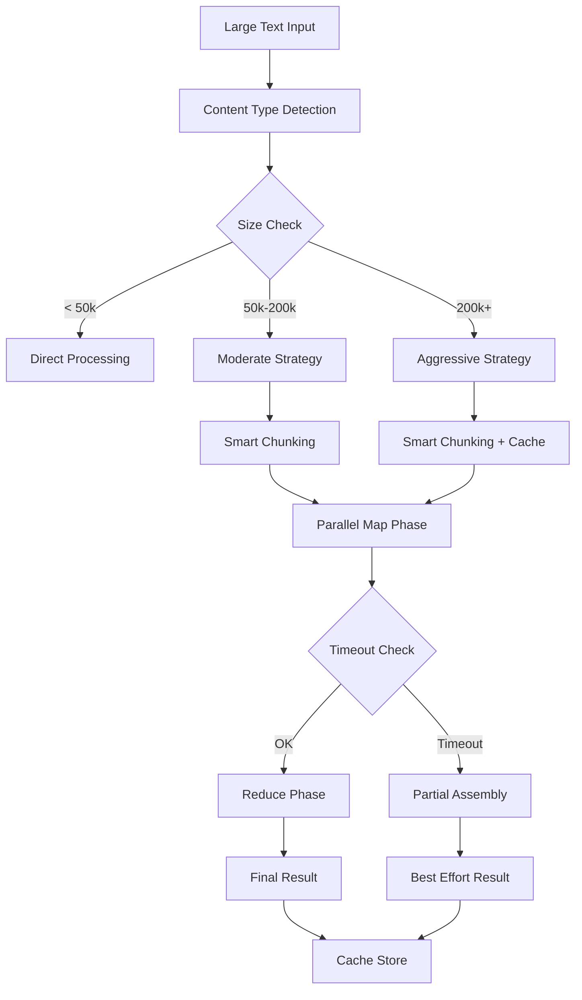

# Архитектурное решение: обработка больших блоков при RAG summarization

## Диагностика проблемы

Из логов видно:
- chunk обработан за `9537ms` (9.5s) → результат `7809` символов
- весь `RAG deferred summarization` упёрся в таймаут `305000ms` (5 минут)
- ошибка в [`api/server/services/agents/context/index.js:212`](../api/server/services/agents/context/index.js:212) (deferred timeout)

## Анализ архитектуры

### Текущий pipeline (из кода):
1. **Начальная обработка**: [`api/server/services/agents/context/builder.js`](../api/server/services/agents/context/builder.js:575)
   - `calculateAdaptiveTimeout(rawVectorTextLength, baseTimeoutMs)` 
   - базовый таймаут: `ragSummaryTimeout = 300000ms` (5 мин)
   - адаптивный расчёт по размеру текста

2. **Chunking**: [`api/server/services/RAG/condense.js`](../api/server/services/RAG/condense.js:562)
   - `splitIntoChunks(contextText, chunkChars, Math.floor(chunkChars * 1.25))`
   - default: `chunkChars = 20_000`, `budgetChars = 12_000`

3. **Map-Reduce**: параллельная обработка chunks → reduce
   - каждый chunk: LLM вызов → summary
   - reduce: объединение summaries → финальный summary

## Корневые причины таймаута

### 1. Низкая конкуренция (concurrency)
- LLM вызовы идут последовательно или с низкой конкуренцией
- Для больших документов (100k+ символов) = 5+ chunks × 10s/chunk = 50s+ только map-фаза

### 2. Неоптимальное chunk distribution
- Фиксированные размеры `chunkChars=20k` не учитывают content complexity
- Технические тексты (код/логи) требуют больше времени на обработку

### 3. Отсутствие прогрессивного fallback
- При timeout весь результат теряется
- Нет механизма "partial success" или incremental progress

### 4. Неадаптивный timeout расчёт
```javascript
// Из api/server/services/agents/context/helpers.js:179
function calculateAdaptiveTimeout(contextLength, baseTimeoutMs) {
  const BASE_CONTEXT_SIZE = 50000;
  // Линейная прогрессия не учитывает exponential growth сложности
}
```

## Архитектурные решения (Best Practices)

### 1. **Прогрессивная обработка с Circuit Breaker**
```
┌─────────────────┐    timeout     ┌──────────────────┐
│ Large Text      │─────────────────→│ Circuit Breaker  │
│ Detection       │                 │ (partial result) │
└─────────────────┘                 └──────────────────┘
        │                                    │
        ▼                                    ▼
┌─────────────────┐                 ┌──────────────────┐
│ Smart Chunking  │                 │ Incremental      │
│ (content-aware) │                 │ Assembly         │
└─────────────────┘                 └──────────────────┘
```

### 2. **Adaptive Concurrency Control**
- **Small text** (< 50k): sequential processing
- **Medium text** (50k-200k): moderate concurrency (2-4 parallel LLM calls)
- **Large text** (200k+): high concurrency (6-8 parallel) + bulk timeout control

### 3. **Multi-tier Timeout Strategy**
```
Level 1: Chunk timeout     →  30s per chunk (fail-fast)
Level 2: Phase timeout     → 120s per map/reduce phase  
Level 3: Total timeout     → 300s total pipeline
Level 4: Emergency cutoff  → 600s hard stop + return partial
```

### 4. **Content-Aware Chunking**
- **Code/logs**: larger chunks (30k), technical summary prompts
- **Natural text**: standard chunks (20k), conversational prompts  
- **Structured data**: format-specific chunking (JSON/tables)

### 5. **Progressive Summarization Levels**
```
Level 0: Raw text         → если < budget, skip summarization
Level 1: Fast truncate    → fallback при timeout (slice + "...")
Level 2: Local summary    → простая конкатенация ключевых фраз
Level 3: LLM summary      → полноценная LLM суммаризация
Level 4: Hierarchical     → рекурсивная multi-level summary
```

## Конкретные улучшения

### A. Circuit Breaker с Partial Results
```javascript
class ProgressiveRAGSummarizer {
  async summarizeWithFallback(text, config) {
    const phases = this.planPhases(text, config);
    const results = [];
    
    for (const phase of phases) {
      try {
        const result = await Promise.race([
          this.processPhase(phase),
          this.timeoutPromise(phase.timeoutMs)
        ]);
        results.push(result);
      } catch (timeout) {
        // Return partial results + fallback processing
        return this.assemblePlusPlus(results, text.slice(phase.start));
      }
    }
    
    return this.assembleResults(results);
  }
}
```

### B. Content-Type Detection
```javascript
function detectContentType(text) {
  if (/```|\b(error|stack|trace|exception)\b/i.test(text)) return 'technical';
  if (/\{|\[|\|/g.test(text) && text.split('\n').length > 5) return 'structured';
  return 'natural';
}
```

### C. Dynamic Parameter Adjustment
```javascript
const SUMMARIZATION_PROFILES = {
  technical: { chunkChars: 30000, concurrency: 2, timeoutPerChunk: 45000 },
  structured: { chunkChars: 25000, concurrency: 4, timeoutPerChunk: 30000 },
  natural: { chunkChars: 20000, concurrency: 6, timeoutPerChunk: 25000 },
};
```

### D. Incremental Assembly Strategy
- Save intermediate summaries to cache/storage
- Resume from last successful chunk при повторных запросах
- Возврат "best effort" результата при partial timeout

## Мermaid: Новый Flow


## Реализация

### Фаза 1: Emergency fixes (немедленно)
- Увеличить `RAG_SUMMARY_TIMEOUT_MS` с `300000` до `600000` (10 минут)
- Добавить graceful degradation в [`api/server/services/agents/context/index.js`](../api/server/services/agents/context/index.js:296)
- Включить более агрессивный local fallback при timeout

### Фаза 2: Architectural improvements (1-2 спринта)
- Реализовать `ProgressiveRAGSummarizer` класс
- Content-type detection и adaptive parameters  
- Incremental caching и resume capability
- Parallel processing optimizations

### Фаза 3: Advanced features (будущее)
- Hierarchical summarization для очень больших документов (1M+ chars)
- Machine learning для оптимизации chunk boundaries
- Predictive timeout estimation на базе historical data

## Быстрый fix для продакшена

1. **Настроить ENV**:
   ```
   RAG_SUMMARY_TIMEOUT_MS=600000
   RAG_CHUNK_CHARS=15000  # smaller chunks = faster processing
   CONDENSE_CONCURRENCY=6  # more parallel LLM calls
   ```

2. **Включить более агрессивный fallback** в deferred context при timeout

3. **Monitoring**: добавить алерты на `rag.condense.chunk_done` durationMs > 30s