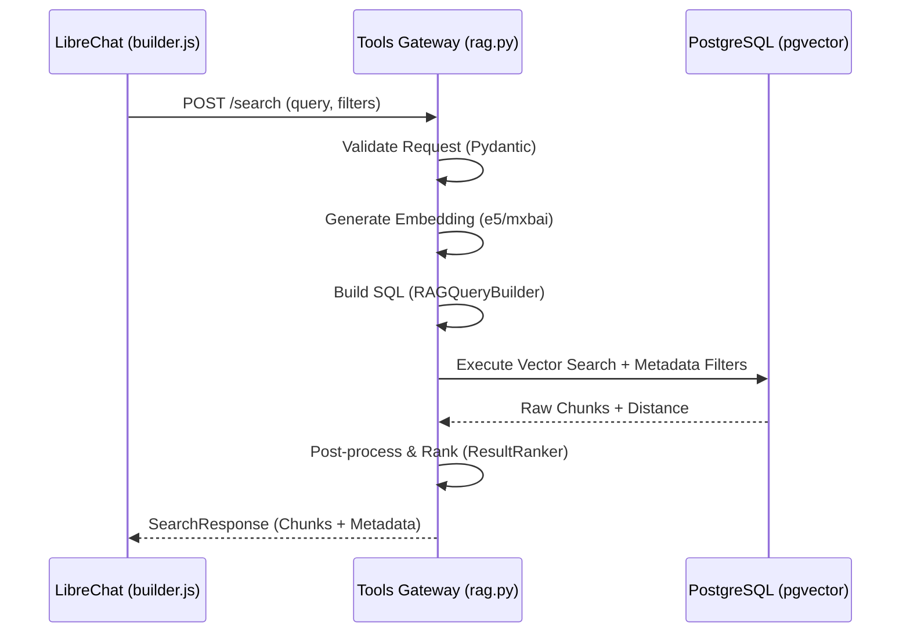

# Техническая спецификация: Редизайн RAG Service (rag.py) и оптимизация Ingestion Pipeline

## 1. Цели и контекст
Текущая реализация RAG в `backend/tools-gateway/services/rag.py` имеет ряд недостатков:
- Смешивание логики формирования SQL и бизнес-логики.
- Недостаточная фильтрация "шума" и старого контекста ассистента.
- Отсутствие строгой типизации и защиты от инъекций на уровне построения запроса.
- Необходимость поддержки больших контекстов (до 200к токенов) и интеграции с `builder.js`/`condense.js`.
- **Отсутствие синергии с графовым поиском:** Векторный поиск и графовый поиск работают изолированно, что снижает точность при сложных запросах о связях между сущностями.

## 2. Архитектура классов

### 2.1. Модели данных (Pydantic)
Использование Pydantic v2 для строгой валидации.

```python
class DateFilter(BaseModel):
    from_date: Optional[datetime] = None
    to_date: Optional[datetime] = None
    strict_content_only: bool = False # Если True, игнорировать created_at полностью

class RAGSearchRequest(BaseModel):
    query: str = Field(..., min_length=1, max_length=1000)
    user_id: str
    conversation_id: Optional[str] = None
    top_k: int = Field(10, ge=1, le=100)
    min_score: float = Field(0.0, ge=0.0, le=2.0)
    embedding_model: str = "e5"
    date_filter: Optional[DateFilter] = None
    include_noise: bool = False
    roles: List[str] = ["user", "assistant"]
```

### 2.2. Основной сервис `RAGService`
Разделение на компоненты:
- `QueryAnalyzer`: Предварительная обработка запроса.
- `VectorSearchEngine`: Работа с БД и векторами.
- `ResultRanker`: Пост-обработка и фильтрация результатов.

## 3. Логика фильтрации и SQL

### 3.1. Интеллектуальная фильтрация по датам
Алгоритм выбора даты:
1. Если в чанке есть `metadata->'content_dates'`:
   - Используем их как основной источник истины.
   - Чанк проходит, если ХОТЯ БЫ ОДНА дата из массива попадает в диапазон.
2. Если `content_dates` отсутствует:
   - Если `role == 'user'`: используем `metadata->>'created_at'` как fallback.
   - Если `role == 'assistant'`: **игнорируем чанк** (защита от "протечек" старых ответов ассистента в новый контекст).

### 3.2. Гибридный поиск (BM25 + Vector)
**Что такое BM25?**
BM25 (Best Matching 25) — это алгоритм ранжирования, основанный на частоте слов (TF-IDF), но с улучшенной обработкой длины документа и насыщения частоты слов. В отличие от векторного поиска, который ищет по *смыслу*, BM25 ищет по *точным совпадениям ключевых слов*.

**Реализация гибридного поиска:**
1. **Vector Score:** Косинусное расстояние или L2.
2. **BM25 Score:** Используется встроенный полнотекстовый поиск PostgreSQL (`tsvector` + `tsquery`).
3. **Reciprocal Rank Fusion (RRF):** Метод объединения результатов двух поисков. Формула: `score = 1 / (k + rank_vector) + 1 / (k + rank_bm25)`. Это позволяет сбалансировать результаты, когда векторный поиск находит "похожее", а BM25 — "точное".

### 3.3. Защита от SQL-инъекций
- Использование `sqlalchemy.text` с именованными параметрами (`:param`).
- Динамическое построение списка `WHERE` условий только из разрешенного набора предикатов.
- Валидация имен колонок (embedding columns) против белого списка.

### 3.4. Исключение шума
- Обязательное условие: `metadata->>'is_noise' IS NOT DISTINCT FROM 'false'`.
- Возможность расширения фильтров через `metadata`.

## 4. Оптимизация Ingestion Pipeline (Приземление данных)

Для того чтобы поиск работал эффективно, данные должны правильно индексироваться при вводе.

### 4.1. Обогащение метаданных при Ingest
1. **Автоматическое извлечение дат:** При вызове `ingest_message`, система должна автоматически извлекать все даты из текста (`extract_content_dates`) и сохрараять их в `metadata->'content_dates'`.
2. **Валидация ролей:** Строгая проверка `role` (user/assistant) для корректной последующей фильтрации.
3. **Детекция шума:** Интеграция классификатора шума (is_noise) на этапе записи, чтобы не индексировать технические сообщения или пустые ответы.

### 4.2. Сквозные ссылки (Cross-Linking)
Для обеспечения целостности данных между векторным хранилищем и графом:
1. **`chunk_id` в Графе:** При создании сущностей в Neo4j, в свойства отношений/узлов добавляется `source_chunk_id`, ссылающийся на UUID чанка в Postgres.
2. **`entity_names` в Векторе:** В метаданные чанка в Postgres добавляется список извлеченных сущностей `entities: List[str]`.

## 5. Графовое обогащение (Graph Enrichment)

Для повышения точности поиска, RAG должен быть дополнен данными из графа знаний (Neo4j).

### 5.1. Механизм интеграции (Backend)
1. **Параллельный поиск:** При поступлении запроса с `include_graph=true`, система одновременно запускает векторный поиск в Postgres и поиск по сущностям в Neo4j.
2. **Обогащение метаданных:** Если чанк в Postgres содержит сущности, найденные в графе, его `score` повышается (boost).
3. **Graph Context в ответе:** В `SearchResponse` добавляется поле `graph_context`, содержащее связанные триплеты, которые помогают LLM лучше понять контекст.

### 5.2. Интеграция с Multi-Step RAG (Frontend/JS)
1. **Изменения в `RagContextBuilder.js`:**
   - Добавить передачу флага `include_graph` в запросы к `tools-gateway`.
   - Реализовать объединение `ragBlock` из векторного поиска и `graphLines` из графового поиска в единый структурированный контекст.
2. **Изменения в `multiStepOrchestrator.js`:**
   - Использовать результаты гибридного поиска для уточнения сущностей на каждом шаге (pass).
   - Если гибридный поиск нашел точное совпадение по ключевым словам (BM25) или графу, уменьшить количество необходимых итераций (early exit).

## 6. Интеграция с фронтендом (LibreChat)

### 6.1. Поддержка больших контекстов
- **Лимит токенов:** Архитектура должна поддерживать до **500,000 токенов**.
- **Оптимизация:** Для таких объемов используется многоуровневая суммаризация в `condense.js` и эффективная передача метаданных.
- **Метаданные:** Возврат расширенных метаданных: `match_type` (vector, date, keyword, hybrid, graph), `original_length`.

### 6.2. Формат ответа
```python
class RAGMatchMetadata(BaseModel):
    score: float
    match_reason: str # "vector_similarity", "date_match", etc.
    role: str
    created_at: datetime
    content_dates: List[datetime]

class RAGChunkResponse(BaseModel):
    content: str
    metadata: RAGMatchMetadata
```

## 6. План реализации (TODO)

### Backend (Python)
1. [ ] Создать новые Pydantic модели в `models/pydantic_models.py` (добавить `include_graph`, `min_bm25_score`).
2. [ ] Реализовать класс `RAGQueryBuilder` в `rag.py` для безопасной сборки SQL (Vector + BM25).
3. [ ] Реализовать логику RRF (Reciprocal Rank Fusion) для объединения результатов векторного и текстового поиска.
4. [ ] Интегрировать вызов `fetch_graph_context` из `services/neo4j.py` внутрь `search_documents`.
5. [ ] Реализовать дифференцированную фильтрацию по датам (логика `role == 'assistant'`).

### Frontend (Node.js)
1. [ ] Обновить `RagContextBuilder.js`: добавить поддержку новых метаданных и флага `include_graph`.
2. [ ] Обновить `multiStepOrchestrator.js`: интегрировать результаты гибридного поиска в цикл итераций.
3. [ ] Добавить обработку `match_type: 'graph'` в визуализации контекста (если применимо).

## 8. Диаграмма последовательности (Sequence Diagram)


