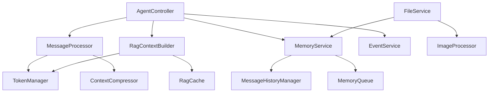

# Этап 6: Обновление документации

## 1. Обновление docs/project_map

```markdown
# Project Map - LibreChat Twin

## Core Services

### Base Infrastructure
- `api/server/services/Base/BaseService.js` - Базовый класс для всех сервисов
- `api/server/services/Base/ErrorHandler.js` - Централизованная обработка ошибок
- `api/server/services/Base/MetricsCollector.js` - Сбор метрик

### Message Processing
- `api/server/services/Messages/MessageProcessor.js` - Обработка сообщений
- `api/server/services/Messages/ContextCompressor.js` - Сжатие контекста

### Memory Management
- `api/server/services/Memory/MemoryService.js` - Управление памятью
- `api/server/services/Memory/MessageHistoryManager.js` - История сообщений

### RAG Services
- `api/server/services/RAG/RagContextBuilder.js` - Построение RAG контекста
- `api/server/services/RAG/RagCache.js` - Кэширование RAG
- `api/server/services/RAG/memoryQueue.js` - Очередь памяти

### File Processing
- `api/server/services/Files/FileService.js` - Обработка файлов
- `api/server/services/Files/images/encode.js` - Обработка изображений

### Event Handling
- `api/server/services/Events/EventService.js` - Управление событиями

## Controllers
- `api/server/controllers/agents/client.js` - Клиентский контроллер
- `api/server/controllers/agents/request.js` - Контроллер запросов

## Dependencies and Relationships


## 2. Обновление docs/1_Trasparent_logging.md

```markdown
# Transparent Logging Initiative - Обновленная структура

## Сервисы и события

### BaseService
- `service.start` - Инициализация сервиса
- `service.error` - Ошибка в сервисе
- Контекст: `{ service, operation, error? }`

### MessageProcessor
- `messages.process.start` - Начало обработки сообщений
- `messages.process.complete` - Завершение обработки
- `messages.compress.start` - Начало сжатия
- `messages.compress.complete` - Завершение сжатия
- Контекст: `{ conversationId, messageCount, compressionRatio? }`

### MemoryService
- `memory.queue.start` - Постановка в очередь
- `memory.queue.complete` - Завершение очереди
- `memory.mark.start` - Начало маркировки
- `memory.mark.complete` - Завершение маркировки
- Контекст: `{ reason, taskCount, messageIds? }`

### RagContextBuilder
- `rag.context.build.start` - Начало построения контекста
- `rag.context.cache.hit` - Попадание в кэш
- `rag.context.cache.miss` - Промах кэша
- `rag.context.build.complete` - Завершение построения
- Контекст: `{ conversationId, cacheStatus, contextLength }`

### FileService
- `files.process.start` - Начало обработки файлов
- `files.process.complete` - Завершение обработки
- `files.longtext.start` - Начало обработки длинного текста
- `files.longtext.complete` - Завершение обработки
- Контекст: `{ fileId, fileType, textLength? }`

### EventService
- `events.send` - Отправка события
- `events.detach` - Отсоединение ответа
- `events.error` - Ошибка события
- Контекст: `{ eventType, status, error? }`

## Форматы логов

### JSON формат
```json
{
  "timestamp": "2026-03-01T16:31:29.191Z",
  "level": "info",
  "scope": "service.name",
  "message": "operation.phase",
  "context": {
    "service": "service.name",
    "requestId": "req-123",
    "conversationId": "conv-456",
    "operation": "specific.operation",
    "additionalData": "value"
  }
}
```

### Текстовый формат
```
2026-03-01T16:31:29.191Z [service.name] info: operation.phase {"context":{"requestId":"req-123","conversationId":"conv-456"}}
```
```

## 3. Обновление docs/TODO.md

```markdown
# LibreChat RAG & Memory Improvement Plan - Обновление

## ✅ Выполненные задачи

1. **Разделение монолитных компонентов**
   - Создана базовая инфраструктура сервисов
   - Внедрено прозрачное логирование
   - Реализована система метрик

2. **Оптимизация обработки сообщений**
   - Создан MessageProcessor
   - Улучшен ContextCompressor
   - Внедрен TokenManager

3. **Улучшение управления памятью**
   - Создан MemoryService
   - Оптимизирован MessageHistoryManager
   - Улучшена работа с очередями

4. **Оптимизация RAG**
   - Обновлен RagContextBuilder
   - Внедрен size-aware RagCache
   - Улучшена обработка длинных текстов

## 🔜 Следующие улучшения

1. **Оптимизация производительности**
   - Профилирование новых сервисов
   - Оптимизация работы с памятью
   - Улучшение кэширования

2. **Улучшение наблюдаемости**
   - Расширение метрик
   - Улучшение трейсинга
   - Добавление алертинга

3. **Дальнейшая модуляризация**
   - Выделение дополнительных сервисов
   - Улучшение интерфейсов
   - Упрощение тестирования
```

## 4. Создание новой документации

### api/server/services/README.md
```markdown
# LibreChat Twin Services

## Архитектура

Сервисы LibreChat Twin построены на принципах:
- Single Responsibility Principle
- Dependency Injection
- Transparent Logging
- Metrics Collection

### Базовые классы

- BaseService: Основа для всех сервисов
- ErrorHandler: Обработка ошибок
- MetricsCollector: Сбор метрик

### Основные сервисы

1. MessageProcessor
   - Обработка сообщений
   - Сжатие контекста
   - Управление токенами

2. MemoryService
   - Управление памятью
   - Очереди задач
   - Дедупликация

3. RagContextBuilder
   - Построение контекста
   - Кэширование
   - Оптимизация токенов

4. FileService
   - Обработка файлов
   - Длинные тексты
   - Изображения

5. EventService
   - SSE события
   - Отсоединяемые ответы
   - Обработка ошибок

## Использование

### Создание нового сервиса
```javascript
const BaseService = require('../Base/BaseService');

class MyService extends BaseService {
  constructor(options = {}) {
    super({ serviceName: 'my.service', ...options });
  }

  async doSomething() {
    const context = { operation: 'do.something' };
    this.log('debug', 'my.service.start', context);
    
    try {
      // Логика
      this.log('info', 'my.service.complete', context);
    } catch (error) {
      this.handleError(error, context);
    }
  }
}
```

### Внедрение зависимостей
```javascript
const service = new MyService({
  tokenManager: new TokenManager(),
  memoryService: new MemoryService(),
  config: { /* конфигурация */ }
});
```

### Логирование
```javascript
this.log('info', 'operation.phase', {
  requestId: req.context.requestId,
  conversationId: req.body.conversationId,
  additional: 'data'
});
```

### Метрики
```javascript
this.metrics.observeDuration('operation_duration', duration, {
  operation: 'specific_operation',
  status: 'success'
});
```
```

## 5. Критерии готовности документации

1. Все новые сервисы и компоненты описаны
2. Обновлены все существующие документы
3. Добавлены примеры использования
4. Описаны метрики и логирование
5. Обновлены диаграммы
6. Добавлены инструкции по миграции

## 6. Проверка документации

1. Актуальность
   - Все новые компоненты описаны
   - Старые описания обновлены
   - Примеры актуальны

2. Полнота
   - Описаны все интерфейсы
   - Добавлены примеры использования
   - Включены диаграммы

3. Понятность
   - Четкая структура
   - Понятные примеры
   - Хорошая навигация

4. Техническая точность
   - Корректные интерфейсы
   - Правильные типы
   - Актуальные метрики

## 7. Следующие шаги

1. Создать PR с обновлениями документации
2. Провести ревью документации
3. Собрать обратную связь от команды
4. Внести финальные правки
5. Обновить индекс документации