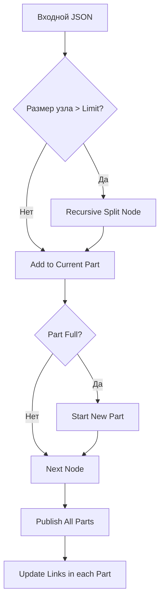

# План исправления ошибки CONTENT_TOO_BIG в Telegraph Poster

Этот план описывает изменения в `telegraph_poster/app.py` для обеспечения надежной публикации длинных материалов путем точного подсчета размера контента и рекурсивного разбиения узлов.

## 1. Уточнение лимитов и замера размера

### 1.1. Константа MAX_CONTENT_LENGTH
Установить `MAX_CONTENT_LENGTH = 60000` (байт). 
*Примечание: Официальный лимит Telegraph составляет около 64 КБ на всё поле `content`. Мы берем запас на JSON-структуру и навигационные ссылки.*

### 1.2. Новая функция `get_node_size(node)`
Заменить `get_text_length` на замер фактического размера JSON-представления:
```python
def get_node_size(node):
    return len(json.dumps(node, ensure_ascii=False).encode('utf-8'))
```

## 2. Алгоритм рекурсивного разбиения узлов

Если один узел (например, очень длинный параграф) превышает `MAX_CONTENT_LENGTH`, его необходимо разбить на части.

### 2.1. Функция `split_large_node(node, limit)`
1. Если размер узла <= limit, вернуть `[node]`.
2. Если узел — строка, разбить её по пробелам или символам до достижения лимита.
3. Если узел — объект с `children`:
   - Если `children` — список, рекурсивно обработать список.
   - Если `children` — строка, разбить строку и создать несколько узлов с тем же тегом.
4. Сохранять атрибуты (например, `href` для ссылок) при разбиении, если это возможно, или закрывать тег и открывать новый.

## 3. Улучшенная логика разбиения контента (`split_content_nodes`)

```python
def split_content_nodes(content, limit):
    parts = []
    current_part = []
    current_size = 2 # Учет [] в JSON
    
    # Предварительный расчет размера навигационного блока
    nav_placeholder_size = 1000 # Запас под ссылки
    effective_limit = limit - nav_placeholder_size

    for node in content:
        node_size = get_node_size(node)
        
        if node_size > effective_limit:
            # Рекурсивное дробление гигантского узла
            sub_nodes = recursive_split(node, effective_limit)
            for sn in sub_nodes:
                # Повторная проверка/добавление в части
                ... 
        else:
            if current_size + node_size + 1 > effective_limit: # +1 для запятой
                parts.append(current_part)
                current_part = []
                current_size = 2
            
            current_part.append(node)
            current_size += node_size + 1
            
    if current_part:
        parts.append(current_part)
    return parts
```

## 4. Навигационные ссылки

### 4.1. Стратегия вставки
1. Ссылки вставляются **в конец** каждой части.
2. Чтобы вставка ссылок не вызвала `CONTENT_TOO_BIG` после публикации:
   - При разбиении основного контента используется `effective_limit` (с запасом ~1-2 КБ).
   - Функция `append_links` должна проверять итоговый размер и, если он все еще превышает жесткий лимит, сокращать количество ссылок (например, оставлять только "Назад" и "Вперед") или выдавать предупреждение.

### 4.2. Формат ссылок
Использовать компактный список `<ul>` или строку с разделителями для минимизации JSON-оверхеда.

## 5. План реализации (TODO)

- [ ] Обновить `MAX_CONTENT_LENGTH` и внедрить `get_node_size`.
- [ ] Реализовать `recursive_split` для обработки узлов, размер которых превышает лимит.
- [ ] Модернизировать `split_content_nodes` для использования `effective_limit`.
- [ ] Добавить проверку размера в `append_links` перед вызовом `edit_page`.
- [ ] Протестировать на экстремально длинных параграфах (>34к символов).

## Схема процесса


